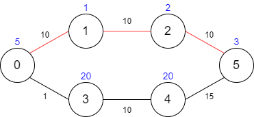

# 1928. Minimum Cost to Reach Destination in Time

There is a country of `n` cities numbered from `0` to `n - 1` where **all the cities** are connected by bi-directional roads. The roads are represented as a 2D integer array `edges` where `edges[i] = [xi, yi, timei]` denotes a road between cities `x`<sub>`i`</sub> and `y`<sub>`i`</sub> that takes `time`<sub>`i`</sub> minutes to travel. There may be multiple roads of differing travel times connecting the same two cities, but no road connects a city to itself.

Each time you pass through a city, you must pay a passing fee. This is represented as a 0-indexed integer array `passingFees` of length n where `passingFees[j]` is the amount of dollars you must pay when you pass through city `j`.

In the beginning, you are at city `0` and want to reach city `n - 1` in `maxTime` **minutes or less**. The cost of your journey is the **summation of passing fees** for each city that you passed through at some moment of your journey (**including** the source and destination cities).

Given `maxTime`, `edges`, and `passingFees`, return the **minimum cost** to complete your journey, or -1 if you cannot complete it within `maxTime` minutes.

##### Example 1:
  
> **Input:** maxTime = 30, edges = [[0,1,10],[1,2,10],[2,5,10],[0,3,1],[3,4,10],[4,5,15]], passingFees = [5,1,2,20,20,3]  
> **Output:** 11  
> **Explanation:** The path to take is 0 -> 1 -> 2 -> 5, which takes 30 minutes and has $11 worth of passing fees.

##### Example 2:
  

> **Input:** maxTime = 29, edges = [[0,1,10],[1,2,10],[2,5,10],[0,3,1],[3,4,10],[4,5,15]], passingFees = [5,1,2,20,20,3]  
> **Output:** 48  
> **Explanation:** The path to take is 0 -> 3 -> 4 -> 5, which takes 26 minutes and has $48 worth of passing fees.
You cannot take path 0 -> 1 -> 2 -> 5 since it would take too long.

##### Example 3:
> **Input:** maxTime = 25, edges = [[0,1,10],[1,2,10],[2,5,10],[0,3,1],[3,4,10],[4,5,15]], passingFees = [5,1,2,20,20,3]  
> **Output:** -1  
> **Explanation:** There is no way to reach city 5 from city 0 within 25 minutes.

##### Constraints:
* `1 <= maxTime <= 1000`
* `n == passingFees.length`
* `2 <= n <= 1000`
* `n - 1 <= edges.length <= 1000`
* `0 <= xi, yi <= n - 1`
* `1 <= timei <= 1000`
* `1 <= passingFees[j] <= 1000`
* The graph may contain multiple edges between two nodes.
* The graph does not contain self loops.

---
##### 思路：
本题可以使用动态规划进行求解。求解的思路是记录每个时间点、可到达的城市的累计花费。计算完后时间范围内，每个时间点对于城市`n-1`的累计花费的最少花费就是所要求的结果。
比如对于例1中的图的结果就是：

  
 

最后一列的最小值就是所要求的结果。当maxTime=29时，最小值是第26时刻的48，当maxTime=30时，最小值是第30时刻的11。

```python
class Solution(object):
    def minCost(self, maxTime, edges, passingFees):
        """
        :type maxTime: int
        :type edges: List[List[int]]
        :type passingFees: List[int]
        :rtype: int
        """ 
```

1. 初始化一些变量

```python
        n = len(passingFees)                     # 城市的数量
```

2. 生成图，这里用了两种方式表达，矩阵和链表形式，后期都会被用到，优化代码速度

```python
        # 使用矩阵表示图，先试试时间符不符合要求
        graph = [[-1] * n for i in range(n)]     # 城市之间的时间距离， -1表示不可达

        # 使用链表形式(List)表示图
        graph_list = [[] for i in range(n)] 

        for edge in edges:
            if graph[edge[0]][edge[1]] != -1:
                if edge[2] >= graph[edge[0]][edge[1]]:
                    continue
            graph[edge[0]][edge[1]] = edge[2]
            graph[edge[1]][edge[0]] = edge[2]    # 双向可达的
            
            graph_list[edge[0]].append([edge[1], edge[2]])
            graph_list[edge[1]].append([edge[0], edge[2]])
```

注: 约束中提到两个节点之间的路径不止一条，所以在生成图时要进行判别。(刚开始以为是指两个城市可以通过其它城市相连导致有多条路径，没想到这道题是指两个城市之间的直接相连的路径就有多个)

3. 求解备忘录中的值

```python
        INT_MAX = 10000 * 1000                   # 题目约束条件：2<=n<=1000, 1<=passingFees[j] <= 1000
        dp = [[-1] * n for i in range(maxTime+1)]               # dp[row][col]表示 当前时间(row)所在城市(col)累计花费的金钱
        dp[0][0] = passingFees[0]

        for i in range(maxTime+1):               # 以花费时间为遍历序列
            for j in range(n):                   # 遍历每一个城市
                currentFees = dp[i][j]           
                if currentFees == -1:            # 等于-1说明在当前时间还未到达该城市
                    continue

                for next, path_time in graph_list[j]:
                    time = i + path_time
                    if time <= maxTime:          # 如果时间允许，更新花费
                        if dp[time][next] == -1:
                            dp[time][next] = passingFees[next]+currentFees
                        elif dp[time][next] != -1:
                            if dp[time][next] > passingFees[next] + currentFees:
                                dp[time][next] = passingFees[next] + currentFees
```

4. 计算返回值

```python
        result = INT_MAX

        for t in range(maxTime+1):
            if dp[t][n-1] != -1:
                result = min(result, dp[t][n-1])           # 寻找[0, maxTime]时间内到达最后一个城市花费最少的金钱
        
        if result == INT_MAX:
            return -1

        return result
```