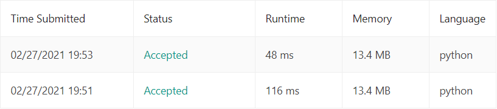

#39.Combination Sum  
##题目  
Given an array of **distinct** integers `candidates` and a target integer `target`, return a list of all **unique
combinations** of `candidates` where the chosen numbers sum to `target`. You may return the 
combinations in **any order**.  
The **same** number may be chosen from `candidates` an **unlimited number of times**. Two combinations
are unique if the frequency of at least one of the chosen numbers is different.  
It is **guaranteed** that the number of unique combinations that sum up to `target` is less than *150*
combinations for the given input.

#####Example 1:  
>**Input:** candidates = [2,3,6,7], target = 7  
>**Output:** [[2,2,3],[7]]  
>**Explanation:**  
>2 and 3 are candidates, and 2 + 2 + 3 = 7. Note that 2 can be used multiple times.
 7 is a candidate, and 7 = 7.
 These are the only two combinations.  

#####Example 2:  
>**Input:** candidates = [2,3,5], target = 8  
>**Output:** [[2,2,2,2],[2,3,3],[3,5]]  

##思路  
在candidates数组中找一些元素使其和等一所给定的target。candudates数组中的元素没有重复的，同时在求解时，同一个元素不
限制使用次数。  
使用深度优先搜索可以解决这个问题。每次搜索遍历数组中的一个元素，并添加到数组path中。   
* 当path中元素的和等于给定的target时，将数组path添加到求解结果result中；
* 当path中元素的和大于给定的target时，停止继续搜索，向上回溯；
* 当path中元素的和小于给定的target时，继续向下搜索。

详细代码为  
```python
class Solution(object):
    def combinationSum(self, candidates, target):
        """
        :type candidates: List[int]
        :type target: int
        :rtype: List[List[int]]
        """
        candidates.sort()                        # 对数据进行排序，方便提前退出
        result = []
        self.dfs(candidates, target, [], result)
        return result

    def dfs(self, candidates, target, path, result):
        """
        :param candidates:
        :param target:
        :param path: 记录临时结果
        :param result: 记录最终结果
        :return:
        """
        if target < 0:
            return
        if target == 0:
            result.append(path)
            return
        for i in range(len(candidates)):
            if candidates[i] > target:           # 提前退出，剪枝提高速度
                break
            self.dfs(candidates[i:], target - candidates[i], path + [candidates[i]], result)
```
      
为了提高运行速度，可以使用一个小技巧，先对candidates进行排序（Line 8:`candidates.sort()`），之后在搜索时，
当path中元素加上当前搜索的元素已经大于target时（Line 27:`if candidates[i] > target:`），停止在当前层面
上继续向后搜索了，因为后面的数只会越来越大。

 

第一行结果是添加剪枝后的运行结果，可以看出，使用剪枝后的运行时间不到原来的一半。