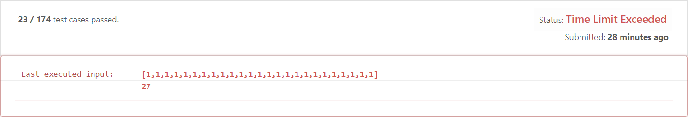
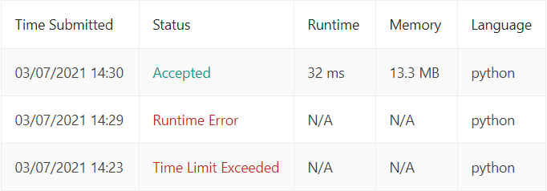
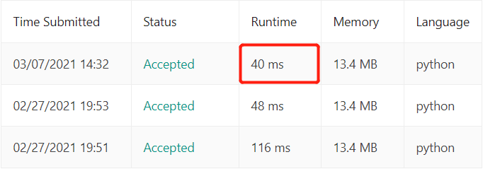

# 40. Combination Sum II
## 题目  
Given a collection of candidate numbers (`candidates`) and a target number (`target`), find all unique combinations
in `candidates` where the candidate numbers sum to `target`.

Each number in candidates may only be used **once** in the combination.

**Note:** The solution set must not contain duplicate combinations.

##### Example 1:
> Input: candidates = [10,1,2,7,6,1,5], target = 8  
> Output:   
> [  
> [1,1,6],  
> [1,2,5],  
> [1,7],  
> [2,6]  
> ]

##### 解体思路
这道题基本和39题类似，不同的地方在于candidates中的数字只能使用一次，同时，最终结果不应出现相同的答案。因此需要对应的做出一些修改即可
* dfs中，遍历完一个元素后，直接向下一层，区别于39题中遍历完一个元素可以在下一次再遍历自身
  * 39题(Line 29)
    ```python
    self.dfs(candidates[i:], target - candidates[i], path + [candidates[i]], result)
    ```
  * 40题(Line 32)
    ```python
    self.dfs(candidates[i + 1:], target - candidates[i], path + [candidates[i]], result)
    ```
    
* 在向`result`数组中添加一个解时，先看一下是否有已经存在的相同解(Line 24-25)
  ```python
  if not path in result :
      result.append(path)
  ```
  
至此代码已经修改完成，不过在提交时发现对于一种情况会出现超时现象。  
  
在思考后，针对此种此种情况做出一些剪枝操作，当在本层遍历其它元素时，若该元素与前一个元素相同（须在最开始对`candidates`
进行排序），跳过遍历该元素（因为最终结果会和前一元素所求解的结果相同）(Line 28-29)，最终ac。  
```python
if i > 0 and candidates[i] == candidates[i-1]:
    continue
```
  
将该方法运用在39题中，发现运行时间也减少了一些
