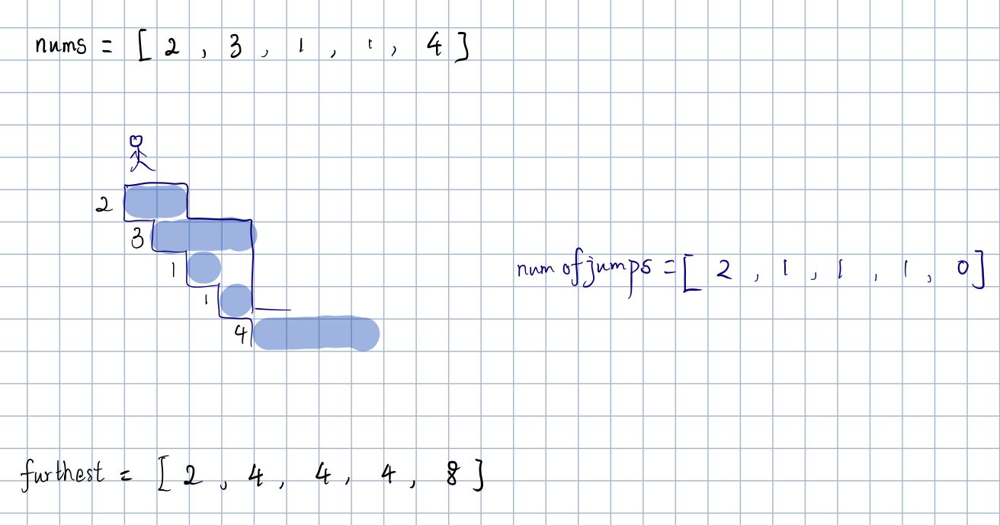

# 45. Jump Game II
Given an array of non-negative integers `nums`, you are initially positioned at the first index of the array.  
Each element in the array represents your maximum jump length at that position.  
Your goal is to reach the last index in the minimum number of jumps.  
You can assume that you can always reach the last index.

##### Example 1:
> **Input:** nums = [2,3,1,1,4]  
> **Output:** 2  
> **Explanation:** The minimum number of jumps to reach the last index is 2. Jump 1 step from index 0 to 1, then 3 
> steps to the last index.

---
##### 思路：
用动态规划求解该题。先展示一个图片更直观的感受一下我的解法。

我们把`nums`看成是一座山的下山台阶，有个会轻功的侠客想尽快 的下山，不过神奇的是，这个侠客在每级台阶能跳的距离不一样，
长度就是所给的对应索引的值，那么他最少需要跳几次可以下山。从图中可以看出，他需要在每级台阶跳向一个在下一次可以跳的
最远的那个台阶。这样就可以尽快的跳下山。
`furthest`记录当前台阶及之前的台阶中能尽力达到的最远的那个台阶的索引。可以通过`nums`正向求解。
```python
        for i in range(len(nums)):
            farthest[i] = i + nums[i]
            if i > 0 and farthest[i] < farthest[i - 1]:
                farthest[i] = farthest[i - 1]
```
`numofjumps`记录的所有台阶到达最后一个台阶所需要的最少的步数，可以通过`furthest`反向求出。  
`point`是求解过程中记录所要到达台阶的索引
```python
        point = len(nums) - 1
        for i in range(len(nums)):
            j = len(nums) - 1 - i
            if j < point:
                if farthest[j] < point:
                    point = j + 1
                numofjumps[j] = numofjumps[point] + 1
```
最后`numofjumps[0]`就是所要求解的值。
```python
        return numofjumps[0]
```