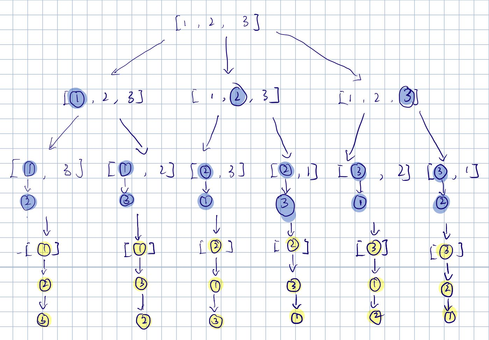

# 46. Permutations
Given an array `nums` of distinct integers, return all the possible permutations.
You can return the answer in **any order**.

##### Example 1:
> **Input:** nums = [1,2,3]  
> **Output:** [[1,2,3],[1,3,2],[2,1,3],[2,3,1],[3,1,2],[3,2,1]]

##### 思路：
思路比较直接，就是一个搜索问题，给一个例子的图示，就能一下明白。  
  
需要解释的就是代码中的result变量，因为python在函数传递时，对字典dict或列表list等可变对象是引用传递，所以可以如此使用。