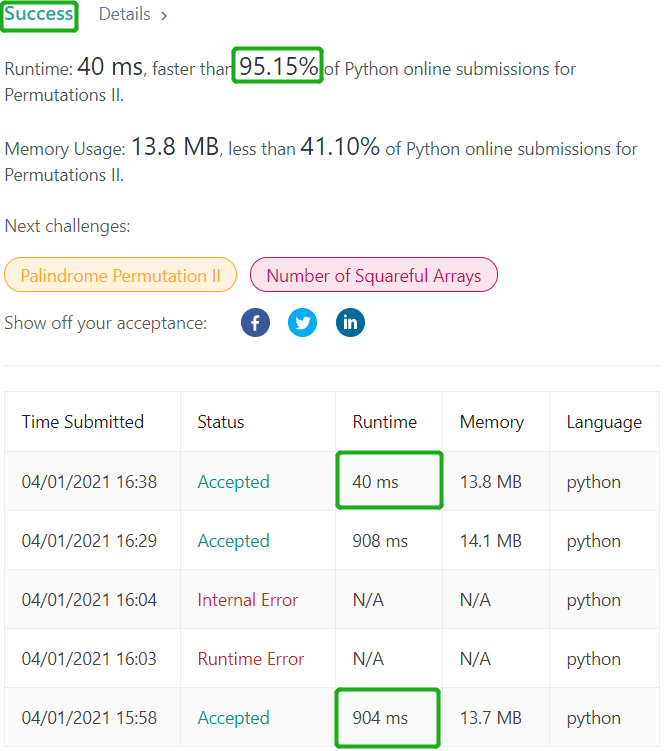

# 47. Permutations II
Given a collection of numbers, `nums`, that might contain duplicates, return all possible
unique permutations in **any order**.

##### Example 1:
> **Input:** nums = [1,1,2]  
> **Output:** [[1,1,2],[1,2,1],[2,1,1]]

___
##### 思路
* 先说一个简单的，在46题的基础上加一个判断分支即可。
```python
    def permute_search_1(self, nums, path, result):
        if len(nums) == 0:
            if not path in result:   # 判断path是否在结果中
                result.append(path)
        else:
            for i in range(len(nums)):
                self.permute_search(nums[:i] + nums[i+1:], path + [nums[i]], result)
```
  如第3行所示，只需要在`path`加入`result`前判断是否已经有和`path`的list，没有的话再加入。  
  但这种方法，时间复杂度比较高，提交时只超过个6%的提交。所以我们要思考一个更省时间的方法，即深度优先搜索时跳过重复的分支。

* 第二种方法，深度优先搜索时要跳过在同级搜索时已经搜索过的相同元素，加快搜索速度。为了实现这个功能，需要在遍历前对`nums`排序，这样在搜索时
  当所要搜索的元素和前一个元素相同时，可以跳过搜索。实现代码如下。
  
```python
class Solution(object):
    def permuteUnique(self, nums):
        """
        :type nums: List[int]
        :rtype: List[List[int]]
        """
        nums.sort()                                    # 对nums排序
        result = []
        self.permute_search(nums, [], result)
        return result

    def permute_search(self, nums, path, result):     
        if len(nums) == 0:
            result.append(path)
        else:
            for i in range(len(nums)):
                if i > 0 and nums[i] == nums[i-1]:     # 跳过与前一个元素相同的元素
                    continue
                self.permute_search(nums[:i] + nums[i+1:], path + [nums[i]], result)
```

两种算法的时间对比：  
  
运行时间从904ms提升到40ms，提升效果明显。