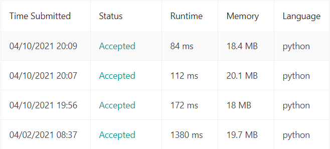

# 49. Group Anagrams
Given an array of strings `strs`, group **the anagrams** together. You can return the answer in
**any order**.

An **Anagram** is a word or phrase formed by rearranging the letters of a different word or phrase, typically using all the
original letters exactly once.

##### Example 1:
> **Input:** strs = ["eat","tea","tan","ate","nat","bat"]  
> **Output:** [["bat"],["nat","tan"],["ate","eat","tea"]]

---
##### 思路
这个题是用来将字母存在颠倒的单词分成一类，所以这题比较重要的就是将同一组但是字母序不相同的单词找出相同的特征，将这个相同的特征
表示为字典中key，然后将单词存在该key所在的value中即可。
这个相同的特征有哪些呢？这里给出两个例子：
* 按照ASCII排序后的结果，如"nat"和"tan"排序后的结果为"ant"，这就是他们共同有的特征；
```python
        output = sorted(strs[i])
```
* 统计单词中每个字母的个数，存在一个长度为26的数组中。
```python
    def embedd(self, str):
        output = [0]*26
        for i in range(len(str)):
            output[ord(str[i])-ord('a')] = output[ord(str[i])-ord('a')] + 1

        return output
```
之后使用字典保存即可，key设为特征值即可。
需要说明的是，第二种方法直接返回的list无法作为dict的key，将其转化为元组即可。`key = tuple(output)`

第一种方法的复杂度为O(n^2*logn),第二种方法的复杂度为O(n^2)，我个人感觉第二种方法好于第一种方法，不过在leetcode中
第一种方法跑的时间快于第二种方法，可能是测试用例的问题。

  

20:09的是第一种方法，20:07的是第二个方法。
