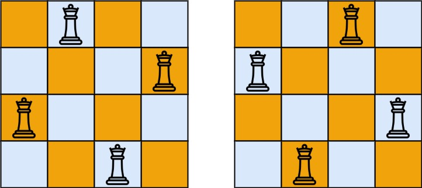

# 51. N-Queens
The **n-queens** puzzle is the problem of placing `n` queens on an `n x n` chessboard such that no two
queens attack each other.

Given an integer n, return all distinct solutions to the ***n-queens puzzle***.

Each solution contains a distinct board configuration of the n-queens' placement, where `'Q'` and `'.'`
both indicate a queen and an empty space, respectively.

##### Example 1:
  
> **Input:** n = 4  
> **Output:** [[".Q..","...Q","Q...","..Q."],["..Q.","Q...","...Q",".Q.."]]  
> **Explanation:** There exist two distinct solutions to the 4-queens puzzle as shown above

---
##### 思路：
N-皇后问题，使用深度优先搜索即可以解出来。  
使用一维数组存储每一行皇后的位置。比使用二维数组方便了许多。  
`positions = [-1] * n                      # 使用一维数组存储第i行Q的位置`

判断`(x,y)`位置是否与现有的棋盘上的皇后冲突。  
```python
    def check(self, positions, x, y):
        n = len(positions)
        if positions[x] > -1:
            return False
        for i in range(n):
            if positions[i] == y:
                return False
            if positions[i] > -1 and abs(i - x) == abs(positions[i] - y):
                return False
        return True
```

递归调用即可解出该题，每一层搜索的是第i行棋盘的解：  
```python
    def solve(self, positions, x):
        """
        使用递归的方式求解
        """
        n = len(positions)
        if x == n:                               # 当棋盘上的皇后数等于n时，找到一个解
            self.result.append(copy.deepcopy(positions))
            return
        else:
            for j in range(n):
                if self.check(positions, x, j):
                    positions[x] = j
                    self.solve(positions, x+1)
                    positions[x] = -1
```

最后处理一下输出即可。