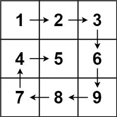

# 54. Spiral Matrix
Given an `m x n` matrix, return all elements of the `matrix` in spiral order.

##### Example 1:
  
> **Input:** matrix = [[1,2,3],[4,5,6],[7,8,9]]  
> **Output:** [1,2,3,6,9,8,7,4,5]

  
> **Input:** matrix = [[1,2,3,4],[5,6,7,8],[9,10,11,12]]
> **Output:** [1,2,3,4,8,12,11,10,9,5,6,7]

---
##### 思路：
提前定义这几个变量  
```python
        self.curDireIndex = 0
        self.Direction = [[0, 1], [1, 0], [0, -1], [-1, 0]]
        m = len(matrix)
        n = len(matrix[0])
        SpiralMatrix = [[0 for i in range(n)] for j in range(m)]
```
`self.curDireIndex`记录当前扫描的方向，`SpiralMatrix`记录对应元素是否被访问过。

函数`next(i,j,SpiralMatrix)`用来获得下一个要访问的索引值，其具体实现为：  
```python
    def next(self, i, j, SpiralMatrix):
        m = len(SpiralMatrix)
        n = len(SpiralMatrix[0])
        next_i = i + self.Direction[self.curDireIndex][0]
        next_j = j + self.Direction[self.curDireIndex][1]
        if next_i < m and next_j < n and SpiralMatrix[next_i][next_j] == 0:
            pass
        else:
            self.curDireIndex = (self.curDireIndex + 1) % 4
            next_i = i + self.Direction[self.curDireIndex][0]
            next_j = j + self.Direction[self.curDireIndex][1]
        return next_i, next_j
```
当前元素加上方向如果索引值不超限并且对应元素未被访问过，即为正确的下一个元素索引，如果不是，改变扫描方向。