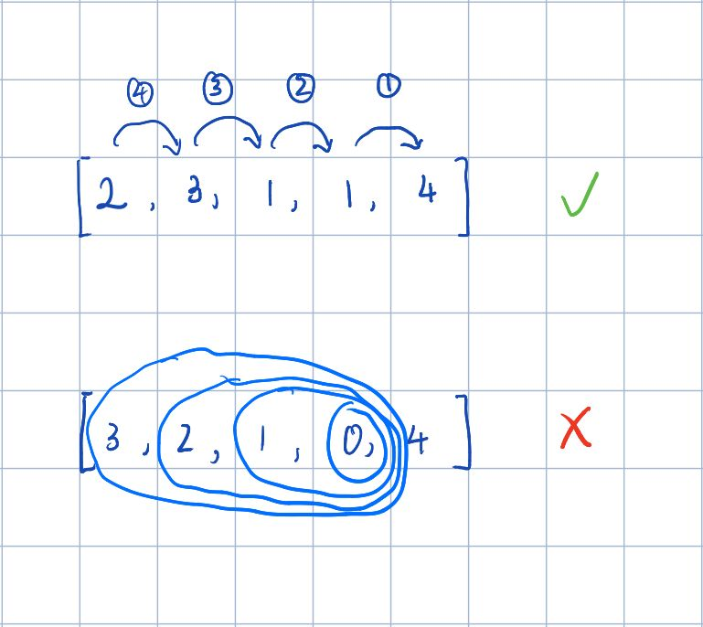

# 55. Jump Game
Given an array of non-negative integers `nums`, you are initially positioned at the **first index** of the array.

Each element in the array represents your maximum jump length at that position.

Determine if you are able to reach the last index.

##### Example 1:
> **Input:** nums = [2,3,1,1,4]  
> **Output:** true  
> **Explanation:** Jump 1 step from index 0 to 1, then 3 steps to the last index.

##### Example 2:
> **Input:** nums = [3,2,1,0,4]  
> **Output:** false  
> **Explanation:** You will always arrive at index 3 no matter what. Its maximum jump length is 0,
> which makes it impossible to reach the last index.

---
##### 思路：
这道题应该从后往前处理，如果从前往后的话复杂多过大。  
从后往前的思路是这样的，如果倒数第二个能到达倒数第一个，倒数第三个能到达倒数第二个，则倒数第三个可以到达倒数第一。  
```python
class Solution(object):
    def canJump(self, nums):
        """
        从最后一个元素，
        :type nums: List[int]
        :rtype: bool
        """
        n = len(nums)
        goal = n - 1
        for i in range(n)[::-1]:
            if i + nums[i] >= goal:
                goal = i

        return True if goal == 0 else False
```
这是具体的代码，goal代表当前找到的可以到达最后一个元素的最靠前的元素，逐步更新goal，直到goal最小，最后检查goal是否未第一个元素。  
这是一个图示。  
