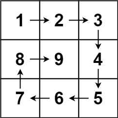

# 59. Spiral Matrix II

Given a positive integer `n`, generate an `n x n` `matrix` filled with elements from `1` to `n`<sup>`2`</sup> in spiral order.

##### **Example 1:**
  
> **Input:** n = 3  
> **Output:** [[1,2,3],[8,9,4],[7,6,5]]

---

##### 思路：
这道题和[54题](../54-SpiralMatrix/solution_ideas.md)类似。解法也类似。  
提前定义这几个变量  

```python
        self.curDireIndex = 0
        self.Direction = [[0, 1], [1, 0], [0, -1], [-1, 0]]
        matrix = [[0] * n for i in range(n)]
```

`self.curDireIndex`记录当前扫描的方向，将`matrix`初始化为`n * n`的二维列表，元素都为`0`。

函数`next(i,j,matrix)`用来获得下一个要访问的索引值，其具体实现为：  

```python
    def next(self, i, j, matrix):
        n = len(matrix)
        next_i = i + self.Direction[self.curDireIndex][0]
        next_j = j + self.Direction[self.curDireIndex][1]

        if next_i < n and next_j < n and matrix[next_i][next_j] == 0:
            pass
        else:
            self.curDireIndex = (self.curDireIndex + 1) % 4
            next_i = i + self.Direction[self.curDireIndex][0]
            next_j = j + self.Direction[self.curDireIndex][1]
        return next_i, next_j
```

当前元素加上方向如果索引值不超限并且对应元素未被访问过，即为正确的下一个元素索引，如果不是，改变扫描方向。  
挨个按照next给的索引值赋值即可。

```python
        row = 0
        col = 0
        curNum = 1
        for i in range(n * n):
            matrix[row][col] = curNum
            row, col = self.next(row, col, matrix)
            curNum += 1
        return matrix
```
