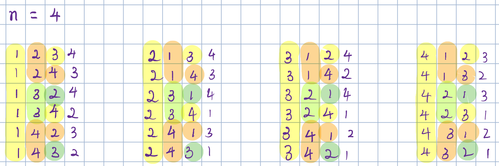

# 60. Permutation Sequence

The set `[1, 2, 3, ..., n]` contains a total of `n!` unique permutations.

By listing and labeling all of the permutations in order, we get the following sequence for `n = 3`:

1. `"123"`
2. `"132"`
3. `"213"`
4. `"231"`
5. `"312"`
6. `"321"`

Given `n` and `k`, return the `kth` permutation sequence.

**Example 1:**
> **Input:** n = 3, k = 3  
> **Output:** "213"

**Example 2:**
> **Input:** n = 3, k = 9  
> **Output:** "2314"

**Example 3:**
> **Input:** n = 3, k = 1  
> **Output:** "123"

---
##### 思路
这道题我是通过计算得到的答案，没有通过之前脑子里闪过的一个一个暴力列举的方式。计算的方式如下：  
我们就拿n=4作为例子(n=3时序列太少了)。序列从`1234`开始，到`4321`结束，这里面有一个规律。以`1`开头的序列有`3!`个，以`2`、`3`、`4`开头的序列也各有`3!`个。即第一位相同的序列个数有`(n-1)!`个。依次类推，前两位相同的序列的个数有`(n-2)!`个。所以我们不需要一个一个的暴力列举，只需要从前往后依次确定即可。
    
确定的方法为：  
`i`从`1`到`n`，`j`从`0`到`n-1`，间隔为`(n-i)!*j`开始数，找到第一个大于`k`的数字，上一个j所对应的数字就是对应位置的数字。每次取一个数字后需要从库里删掉，同时更新一下`k`。  
具体代码为：  

```python
class Solution(object):
    def getPermutation(self, n, k):
        """
        :type n: int
        :type k: int
        :rtype: str
        """
        result = ""
        labels = [i for i in range(1, n+1)]
        rest = k
        for i in range(n):
            for j in range(n):
                if math.factorial(len(labels)-1) * (j+1) >= rest:
                    result += str(labels[j])
                    rest = rest - math.factorial(len(labels)-1) * j
                    del labels[j]
                    break

        return result
```

这道题的重点的思路就是不要挨个找，直接计算每个前缀对应的个数，然后大跨步的向前找。