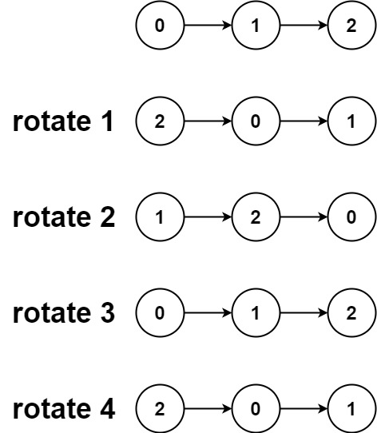

# 61. Rotare List

Given the `head` of a linked list, rotate the list to the right by `k` places.

##### Example 1:
  
> **Input:** head = [1, 2, 3, 4, 5], k = 2  
> **Output:** [4, 5, 1, 2, 3]

##### Example 2:
  
> **Input:** head = [0, 1, 2], k = 4  
> **Output:** [2, 0, 1]

---
##### 思路：
使用**双指针**    
先将第一个指针指向第k+1个节点  

```python
        # 找到第k+1个节点
        while length < k+1 and curNode != None:
            preNode = curNode
            curNode = curNode.next
            length += 1
        # 如果k比链表的长度大
        if curNode == None:
            length -= 1
            k = k % length
            curNode = head
            for i in range(k):
                preNode = curNode
                curNode = curNode.next
```

再将第二个指针指向第k个节点  

```python
        curNode_1 = head
        preNode_1 = None
```

两个指针一起向前走，直到第一个指针走完所有节点  

```python
        while curNode != None:
            preNode = curNode
            curNode = curNode.next
            preNode_1 = curNode_1
            curNode_1 = curNode_1.next  
```

这样第二个指针指向的就是倒数第k个节点。将最后一个节点和head节点连起来，并且断开倒数第k个节点和前一个节点。返回倒数第k个节点即可。

```python
        preNode.next = head
        preNode_1.next = None

        return curNode_1
```

大致思路即为上述所言，涉及到一些边界条件可以看[对应详细代码](./solution_code.py)。