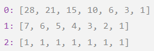

# 62. Unique Paths

A robot is located at the top-left corner of a `m x n` grid (marked 'Start' in the diagram below).

The robot can only move either down or right at any point in time. The robot is trying to reach the bottom-right corner of the grid (marked 'Finish' in the diagram below).

How many possible unique paths are there?

##### Example 1:
  
> **Input:** m = 3, n = 7  
> **Output:** 28

##### Example 2:
> **Input:** m = 3, n = 2  
> **Output:** 3  
> **Explanation:**   
> From the top-left corner, there are a total of 3 ways to reach the bottom-right corner:
> 1. Right -> Down -> Down
> 2. Down -> Down -> Right
> 3. Down -> Right -> Down

---
##### 思路：
当机器人不在最下一行和最右一列时(即不在Finsh所在的行和列)，每一个位置机器人有两个选择：向右或向下；当机器人在最下一行时，只有一个选择，向右；当机器人在最有一列时只能选择向下。  
**机器人在某一个位置的可选择路径条数是每一个可选择的下一个位置路径相加**(请仔细琢磨这句话)。例如当机器人在`(0,1)`位置的可选择路径条数有`a`个，在`(1,0)`位置的可选择路径条数有`b`个，则可计算出在`(0,0)`的可选择路径有`a+b`条。  
通过以上分析可以得到，这道题可以用递归求解。  
不过递归的复杂度略高。因此我用了动态规划求解。  
从Finish`(m-1，n-1)`位置(初始化为`1`)，逐步向前求解，直到求得Start`(0,0)`位置。  
例1(m=3,n=7)求解过程中的备忘录为：  

||0|1|2|3|4|5|6|
|:-:|:-:|:-:|:-:|:-:|:-:|:-:|:-:|
|**0**|28|21|15|10|6|3|1|
|**1**|7|6|5|4|3|2|1|
|**2**|1|1|1|1|1|1|1|

  