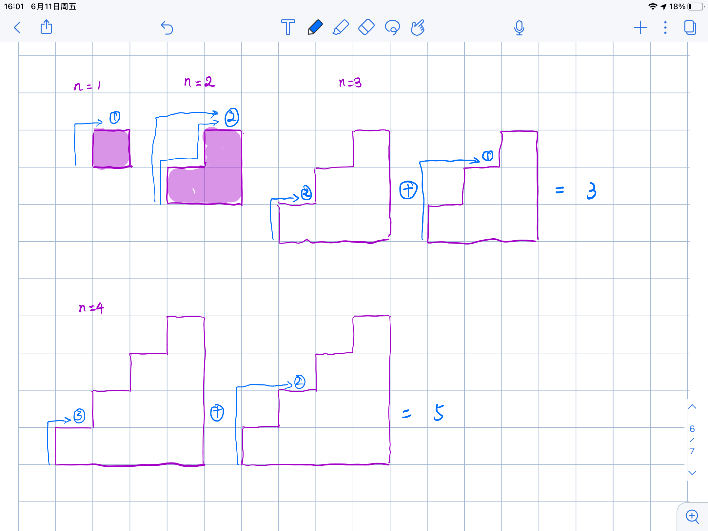

# 70. Climbing Stairs

You are climbing a staircase. It takes `n` steps to reach the top.

Each time you can either climb `1` or `2` steps. In how many distinct ways can you climb to the top?

##### Example 1:

> **Input:** n = 2  
> **Output:** 2  
> **Explanation:** There are two ways to climb to the top.
> 1. 1 step + 1 step
> 2. 2 steps

##### Example 2:

> **Input:** n = 3  
> **Output:** 3
> **Explanation:** There are three ways to climb to the top.
> 1. 1 step + 1 step + 1 step
> 2. 1 step + 2 steps
> 3. 2 steps + 1 step

---
##### 思路：
连着几道都是动态规划的题。这道题用动态规划后也蛮简单，所以是`easy`题。 
来个图说明一下就懂了。  

1. `n=1`时，有1条路径可以到达`top`；
2. `n=2`时，有2条路径可以到达`top`；
3. `n=3`时，走一步到达倒数第2个台阶，走两步到达倒数第1个台阶，因为到达`top`的路径为`2+1=3`；
4. `n=4`时，走一步到达倒数第3个台阶，走两步到达倒数第2个台阶，因为到达`top`的路径为`3+2=5`；
5. 依次类推......
