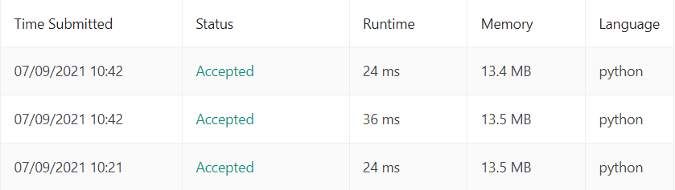

# 75. Sort Colors

Given an array `nums` with `n` objects colored red, white, or blue, sort them **in-place** so that objects of the same color are adjacent, with the colors in the order red, white, and blue.

We will use the integers `0`, `1`, and `2` to represent the color red, white, and blue, respectively.

You must solve this problem without using the library's sort function.

##### Example 1:

> **Input:** nums = [2,0,2,1,1,0]  
> **Output:** [0,0,1,1,2,2]

##### Example 2:

> **Input:** nums = [2,0,1]  
> **Output:** [0,1,2]

---
##### 思路：

使用计数排序

```python
class Solution(object):
    def sortColors(self, nums):
        """
        :type nums: List[int]
        :rtype: None Do not return anything, modify nums in-place instead.
        """
```

1. 第一次遍历，算出每个元素的个数

```python
        num_0 = 0
        num_1 = 0
        num_2 = 0
        for num in nums:
            if num == 0:
                num_0 = num_0 + 1
            elif num == 1:
                num_1 = num_1 + 1
            elif num == 2:
                num_2 = num_2 + 1
```

2. 第二次遍历，把值放进去

```python
        for i in range(num_0):
            nums[i] = 0
        for i in range(num_1):
            nums[num_0+i] = 1
        for i in range(num_2):
            nums[num_0+num_1+i] = 2
```

还有另一种比较简洁的方式，但这种方式是创建了新的内存空间挂过去的，时间长花费多一点，但时间复杂度其实是一样的。

```python
        nums[0:num_0] = [0] * num_0
        nums[num_0:num_0+num_1] = [1] * num_1
        nums[num_0+num_1:num_0+num_1+num_2] = [2] * num_2
```

